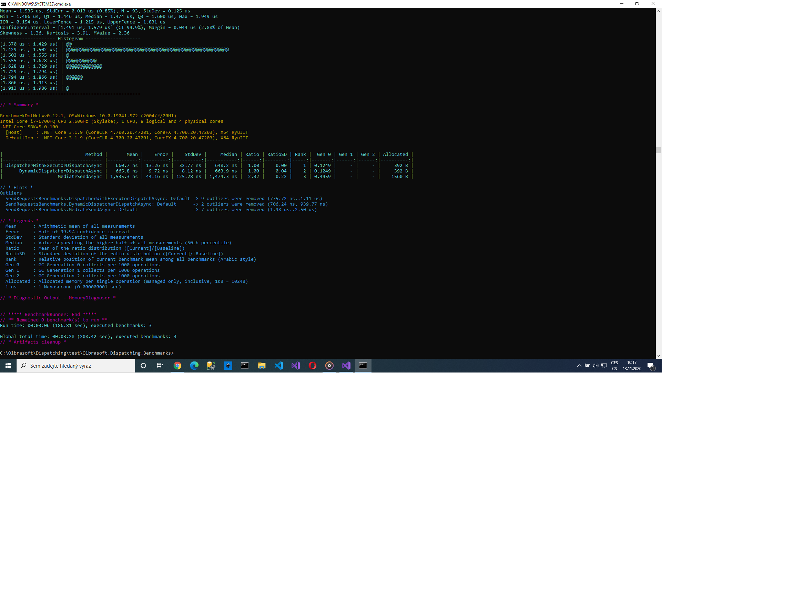

# Dispatching

 Olbrasoft.Dispatching.Common  
 Olbrasoft.Dispatching.Dynamic  
 Olbrasoft.Dispatching.WithExecutor  
 Olbrasoft.Dispatching.DependencyInjection  
 Olbrasoft.Dispatching.DependencyInjection.Microsoft  
 Olbrasoft.Dispatching.Dynamic.DependencyInjection.Microsoft  
 Olbrasoft.Dispatching.WithExecutor.DependencyInjection.Microsoft  

