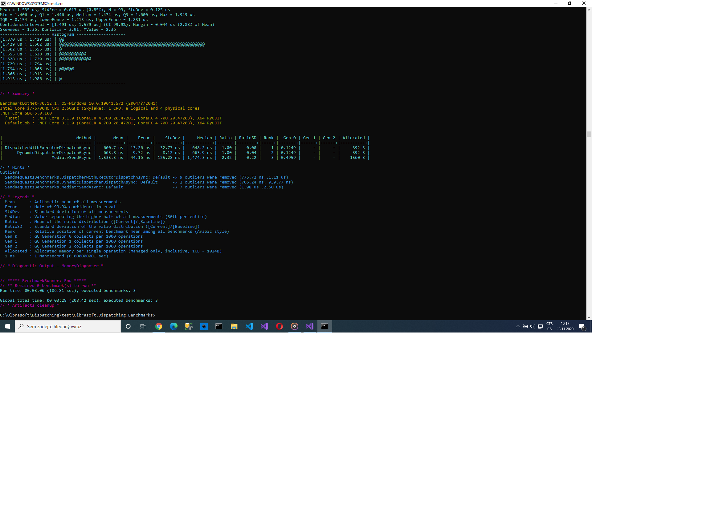

 Dispatching   
  
  
 Olbrasoft.Dispatching.Abstractions  
 Olbrasoft.Dispatching.Dynamic  
 Olbrasoft.Dispatching  
 Olbrasoft.Dispatching.DI.Common  
 Olbrasoft.Dispatching.DI.Microsoft.Common  
 Olbrasoft.Dispatching.DI.Microsoft  
 Olbrasoft.Dispatching.Dynamic.DI.Microsoft

Benchmark DispatcherWithExecutor vs DynamicDispatcher vs Mediatr:  

